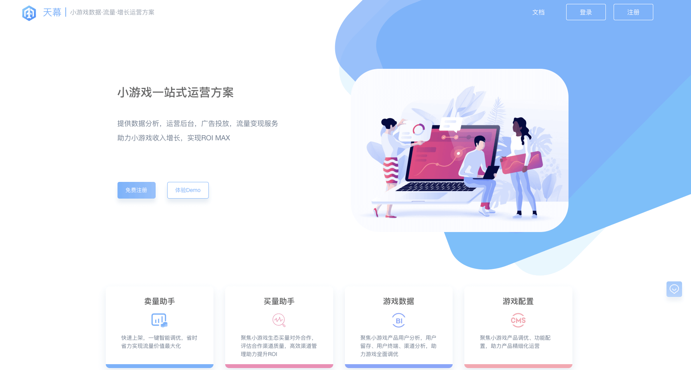
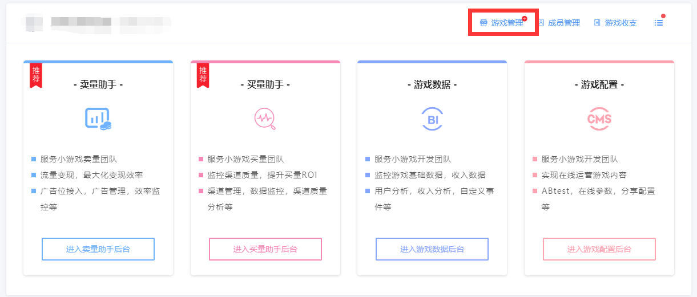

# 新手入门

## 1、简介

天幕是服务于微信小游戏开发者/运营者的一站式运营方案，由**四个模块**组成：

[卖量助手](selling/)：流量变现，最大化变现效率

[买量助手](channel/)：渠道监控，最大化渠道投放ROI

[游戏数据](game-data/)：全面深度的数据监控

[游戏配置](game-set/)：在线管理游戏分享转发素材、在线配置参数与ABtest等内容


四个主模块**相互独立**，可按需接入；

当接入全部模块时，可实现数据互通，实现真正**一站式运营**。


天幕产品简介下载（pdf版）



## 2、主体

类似微信主体的一个抽象概念：

1. 游戏隶属于主体
2. 每个主体下有上述的四个主功能模块及其他次要模块

一个天幕账号可以创建多个主体，创建主体的用户默认为超级管理员，拥有该主体的全部权限


建议一个公司/团队下的游戏项目放在一个主体内进行管理。


## 3、加入天幕的方式

目前支持以下方式加入天幕：

1. 直接注册天幕账号；
2. 已有账号用户邀请加入；

### **3.1、直接注册**

天幕已开放注册，用户可在[天幕的官网](https://www.skysriver.com/)，点击右上角的注册按钮，使用手机号注册。

新注册的账户，系统会自动创建一个该账户的主体。

### **3.2、邀请加入**

已有账号用户登录天幕系统，创建主体后，可通过成员管理模块，点击添加成员，在弹出的页面填写成员手机号进行邀请。

请注意：

* 若成员已注册了天幕账号，重新登录后即可看见被邀请加入的主体；
* 若成员未注册天幕账号，则会收到一条带登录密码的手机短信，使用用户手机号+短信密码即可登录天幕系统；


超级管理员创建主体后，邀请相关开发运营人员进入即可


## 4、账号角色

### 4.1、三种角色

一个天幕主体下的账号，按照角色分为三种：

1. 超级管理员；
2. 管理员；
3. 普通成员；

创建主体的账号默认为超级管理员（角色可转移），每个天幕主体拥有**1个超级管理员**，可设置**多个管理员**，**多个普通成员**。

### 4.2、角色权限

不同角色拥有不同权限。

#### **超级管理员**

1. 设置管理员；
2. 可将管理员、普通成员移出主体；
3. 设置管理员、普通成员四个模块的权限；
4. 四个模块的全部权限；
5. 为主体添加、移除小游戏；

#### **管理员**

1. 将普通成员移出主体；
2. 设置管理员、普通成员四个模块的权限；
3. 四个模块的全部权限；
4. 为主体添加小游戏、移除小游戏；

#### **普通成员**

1. 四个模块的被设置的权限；
2. 为主体添加小游戏；

权限功能说明详见：[天幕权限功能说明](general-function/permission.md)

## 5、添加第一款游戏

## 6、SDK接入

### 6.1、兼容性

1. 天幕SDK支持现有主流的小游戏开发引擎：Cocos、Laya、Egret
2. 因微信本身机制限定，在登录获取openid时，存在兼容性风险，需做处理，[查看详细](questions/compatibility.md)
3. 与阿拉丁SDK兼容

### 6.2、留意事项

请留意：

1. **天幕四个主要功能模块共用一个SDK；**
2. **每个游戏一个单独的SDK，不可复用**。

接入时，请参照不同模块中的“技术接入指南”：

1. [卖量助手——技术接入指南](selling/dev-guide/)
2. [买量助手——技术接入指南](channel/dev-guide/)
3. [游戏数据——技术接入指南](game-data/dev-guide/)
4. [游戏配置——技术接入指南](game-set/dev-guide/)

接入多个模块的功能时，前缀为【通用】的功能/接口无需重复接入。

您在接入功能以及使用过程有何问题，可以到[常见问题](questions/)中查找。

### 6.3、接入工作量预估

以下为四个“主模块”及“游戏收支”功能正常使用**所需的SDK接入工作**：

（×代表当前接入状态此模块无法使用，需更多接入工作）

<table>
  <thead>
    <tr>
      <th style="text-align:left"></th>
      <th style="text-align:left">&#x672A;&#x5F15;&#x5165;SDK</th>
      <th style="text-align:left">&#x2460;&#x76F4;&#x63A5;&#x5F15;&#x5165;SDK</th>
      <th style="text-align:left">&#x66F4;&#x591A;</th>
    </tr>
  </thead>
  <tbody>
    <tr>
      <td style="text-align:left"><a href="selling/">&#x5356;&#x91CF;&#x52A9;&#x624B;</a>
      </td>
      <td style="text-align:left">&#xD7;</td>
      <td style="text-align:left">&#xD7;</td>
      <td style="text-align:left">&#x2714; &#x2461;&#x63A5;&#x5165;&#x5E7F;&#x544A;&#x4F4D;</td>
    </tr>
    <tr>
      <td style="text-align:left"><a href="channel/">&#x4E70;&#x91CF;&#x52A9;&#x624B;</a>
      </td>
      <td style="text-align:left">&#xD7;</td>
      <td style="text-align:left">&#x2714;&#x5168;&#x90E8;&#x529F;&#x80FD;</td>
      <td style="text-align:left"></td>
    </tr>
    <tr>
      <td style="text-align:left"><a href="game-data/">&#x6E38;&#x620F;&#x6570;&#x636E;</a>
      </td>
      <td style="text-align:left">&#xD7;</td>
      <td style="text-align:left">
        
&#x2714;95%&#x529F;&#x80FD;&#xFF0C;&#x91CD;&#x70B9;&#x529F;&#x80FD;

        
&#x5747;&#x53EF;&#x4F7F;&#x7528;

      </td>
      <td style="text-align:left">
        
&#x2462;&#x6027;&#x80FD;&#x5206;&#x6790;&#x3001;&#x5185;&#x8D2D;

        
&#x5206;&#x6790;&#x6309;&#x9700;&#x63A5;&#x5165;

      </td>
    </tr>
    <tr>
      <td style="text-align:left"><a href="game-set/">&#x6E38;&#x620F;&#x914D;&#x7F6E;</a>
      </td>
      <td style="text-align:left">&#xD7;</td>
      <td style="text-align:left">&#xD7;</td>
      <td style="text-align:left">
        
&#x2714;&#x2463;&#x6240;&#x6709;&#x529F;&#x80FD;&#x5747;&#x9700;

        
&#x5355;&#x72EC;&#x63A5;&#x5165;

      </td>
    </tr>
    <tr>
      <td style="text-align:left"><a href="general-function/revenue/">&#x6E38;&#x620F;&#x6536;&#x652F;</a>
      </td>
      <td style="text-align:left">
        
&#x4EC5;&#x53EF;&#x67E5;&#x770B;&#x5FAE;&#x4FE1;

        
&#x5B98;&#x65B9;&#x5E7F;&#x544A;&#x6536;&#x5165;

      </td>
      <td style="text-align:left">&#x2714;&#x5168;&#x90E8;&#x529F;&#x80FD;</td>
      <td style="text-align:left"></td>
    </tr>
  </tbody>
</table>

以下为上表中**不同SDK接入工作的工作量**预估，供参考：

<table>
  <thead>
    <tr>
      <th style="text-align:left">&#x63A5;&#x5165;&#x5DE5;&#x4F5C;</th>
      <th style="text-align:left">&#x9884;&#x4F30;&#x5DE5;&#x4F5C;&#x91CF;&#xFF08;<b>&#x5355;&#x4EBA;</b>&#xFF09;</th>
    </tr>
  </thead>
  <tbody>
    <tr>
      <td style="text-align:left">&#x2460;<a href="selling/dev-guide/add-sdk.md">&#x76F4;&#x63A5;&#x5F15;&#x5165;SDK</a>
      </td>
      <td style="text-align:left">10min&#xFF08;&#x5982;&#x6709;&#x517C;&#x5BB9;&#x6027;&#x95EE;&#x9898;&#xFF0C;&#x4F1A;&#x989D;&#x5916;&#x589E;&#x52A0;&#x5DE5;&#x4F5C;&#x91CF;&#xFF09;</td>
    </tr>
    <tr>
      <td style="text-align:left">
        
&#x2461;<a href="selling/dev-guide/">&#x5356;&#x91CF;&#x52A9;&#x624B; - </a>
        

        
<a href="selling/dev-guide/">&#x63A5;&#x5165;&#x5E7F;&#x544A;&#x4F4D;</a>
        

      </td>
      <td style="text-align:left">&#x521D;&#x6B21;&#x63A5;&#x5165;2&#x5929;&#xFF0C;&#x719F;&#x6089;&#x540E;&#x63A5;&#x5165;1&#x5929;</td>
    </tr>
    <tr>
      <td style="text-align:left">
        
&#x2462;<a href="game-data/dev-guide/">&#x6E38;&#x620F;&#x6570;&#x636E; - </a>
        

        
<a href="game-data/dev-guide/">&#x6027;&#x80FD;&#x5206;&#x6790;&#x3001;&#x5185;&#x8D2D;&#x5206;&#x6790;</a>
        

      </td>
      <td style="text-align:left">&#x6BCF;&#x9879;0.5h</td>
    </tr>
    <tr>
      <td style="text-align:left">
        
&#x2463;<a href="game-set/dev-guide/">&#x6E38;&#x620F;&#x914D;&#x7F6E; - </a>
        

        
<a href="game-set/dev-guide/">&#x5168;&#x90E8;&#x529F;&#x80FD;</a>
        

      </td>
      <td style="text-align:left">&#x5206;&#x4EAB;&#x7D20;&#x6750;&#x914D;&#x7F6E;2h&#xFF0C;&#x5176;&#x4F59;&#x6BCF;&#x9879;0.5h</td>
    </tr>
  </tbody>
</table>


四个模块共用一个SDK，无需重复引入


## 7、数据安全

天幕始终将用户的数据安全视为最重要的事情，全力保障接入天幕系统的用户数据安全。

相关链接：[天幕服务条款](terms/)

## 8、贴心服务

我们强烈建议您添加如下微信号，

在您了解、接入、使用天幕过程中，我们会提供全程的服务和支持


建议进一步建立微信对接群，添加天幕技术、产品人员

获取从接入、使用、运营的全方位支持，第一时间获得天幕最新动态


