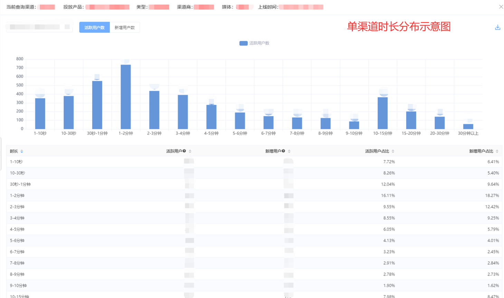

# 天幕更新日志

## v3.2.0 - 2020-10-27

字节跳动版主体游戏数据、游戏收支功能上线

【游戏数据】

接入的游戏现可查看用户留存、时长、收入、来源（场景值）等游戏数据

【游戏收支】

支持查询所有广告类型收入、内购收入以及支出

注：所有收入与支出均需要使用者在游戏收支功能中上传后方可查询

## v3.1.1 - 2020-10-20

微信版主体功能更新如下：

【卖量助手】-支持设置广告主游戏在特定时间上架展示

操作位置：卖量助手-投放管理-点击流量主游戏-点击生效时间进行配置  

【数据与收支】-增加微信原生模板广告类型相关收入与广告数据指标

字节跳动版主体功能更新如下：

【买量助手】-字节跳动版支持买量助手，可创建投放的渠道与渠道商管理

## v3.1.01 - 2020-09-27

【本周天幕支持新建字节跳动版主体】： 

*  支持创建字节跳动版主体并下载SDK接入游戏 
* 支持字节跳动小游戏接入天幕游戏配置功能 

字节跳动版买量助手、数据统计、游戏收支等功能已在开发中，将在国庆后陆续上线，敬请期待。

【本周天幕微信QQ版功能更新】： 

* 在原有SDK基础上增加无登录功能兼容版SDK

 部分开发者已自行接入微信QQ登录或者其他运营平台的基础上想要接入天幕功能，现可使用无登录功能兼容版天幕SDK，通过发送openid给天幕即可使用天幕大部分功能。 

【无登录功能兼容版天幕SDK接入说明 】

* 微信版：[https://doc.skysriver.com/selling/dev-guide/add-sdk\#2-wu-deng-lu-ban-sdk-shi-yong-shuo-ming](https://doc.skysriver.com/selling/dev-guide/add-sdk#2-wu-deng-lu-ban-sdk-shi-yong-shuo-ming) 
* QQ版：[https://qq.skysriver.com/dev-guide/basic/add-sdk\#2-wu-deng-lu-ban-sdk-shi-yong-shuo-ming](https://qq.skysriver.com/dev-guide/basic/add-sdk#2-wu-deng-lu-ban-sdk-shi-yong-shuo-ming)

【天幕字节跳动小游戏使用说明】： 

* 字节跳动小游戏接入需先创建字节跳动版主体，而后将字节跳动版小游戏添加至该主体中。 

字节跳动版主体创建入口：控制台-上方个人“设置”-新建主体-平台类型选择字节跳动. 创建字节跳动版主体后方可添加字节跳动小游戏。

* 字节跳动版小游戏接入天幕技术指南：[https://tt.skysriver.com/dev-guide/basic](https://tt.skysriver.com/dev-guide/basic) 
* 字节跳动版与微信、QQ版主体各自独立，人员权限、数据分别独立管理

## v3.0.1 - 2020-09-15

【自定义事件】功能更新

* 后台未配置的参数以及上报时与后台参数ID不一致的参数不统计计算，未定义参数将过滤不上报与统计分析

字节跳动平台小游戏功能正在开发中，敬请期待。

## v3.0.0 - 2020-09-01

本周天幕QQ版更新功能：

* 增加游戏数据统计功能 
* 增加游戏收支功能（需人工上传数据）

QQ小游戏使用说明： 

* QQ小游戏接入需先创建QQ版主体，而后将QQ版小游戏添加至该主体中。  QQ版主体创建入口：控制台-上方个人“设置”-新建主体-平台类型选择QQ.  创建QQ版主体后方可添加QQ小游戏。

QQ版小游戏接入天幕技术指南：[https://qq.skysriver.com/dev-guide](https://qq.skysriver.com/dev-guide)

*  QQ版与微信版主体各自独立，人员权限、数据分别独立管理

更多平台小游戏功能正在开发中，敬请期待。

## v2.9.0 - 2020-08-18

支持接入QQ版小游戏，需要创建QQ版主体后方可添加QQ小游戏。

 1. 支持下载QQ版SDK并接入游戏 

2. 支持使用游戏配置功能 

3. 支持买量助手功能

## v2.8.5.1-2020-08-04

【卖量助手】

 1、修改结算单生成逻辑，支持与外部用户合作期间，结算单价有过变动的特殊情况

【游戏收支】 

1、用户上传内购退款数据后，自动修正ROI等相关指标

## v2.8.5 - 2020-07-28

【卖量助手】

 1、广告主游戏支持添加备注说明，可用于备注投放效果、单价变更等信息。

 路径：卖量助手-广告主游戏管理 

2、修复过滤老用户游戏端显示异常的BUG

【买量助手】 

1、优化买量成本在线上传的操作体验

【游戏收支】

 1、微信收入管理支持在线上传内购收入

## v2.8.4 - 2020-07-22

【游戏收支】

 1、卖量收入、买量成本支持后台直接上传；同时保留原有excel批量上传的模式。 

2、卖量收入管理中显示当前记录的结算单价。

【卖量助手】 

1、屏蔽老用户功能： 

1. 设置了此功能后，用户跳转过特定广告主游戏后，当天在该流量主游戏上将不再看到该广告主游戏的所有创意（仅限当天，第二天重置）
2. 在“流量主游戏-广告主游戏”粒度上设置、生效。
3. 操作路径：卖量助手-投放管理-特定流量主游戏。

2、优化创意的添加/删除操作。 

3、结算单支持导出为excel格式。

【买量助手】 

1、进一步细化来源类型为“其他”的新增用户。

【游戏配置】 

1、修复ABtest中自定义事件计算异常BUG。

## v2.8.3 - 2020-07-14

【买量助手】 

1、自动计算/上传买量成本 

1. 对外买量时，当与流量主以“天幕”为依据进行结算时，可预设单价等信息，实现系统自动上传买量成本，无需手动上传。
2. 说明文档：[https://doc.skysriver.com/channel/main-features/cost-calculations](https://doc.skysriver.com/channel/main-features/cost-calculations) 

2、渠道监控显示指标调整

 【游戏收支】 

1、内购退款管理后台，在上传了退款数据后，会自动更新当天的收支记录

【卖量助手】 

1、结算单功能优化

## v2.8.2 - 2020-07-06

【游戏收支】 

1、新增内购退款管理后台，支持在线管理内购退款记录

路径：游戏收支——内购退款管理；

（上传数据后对当天的收支数据、毛利等进行自动调整的功能将在下期上线） 

2、买量成本上传逻辑修正——当天没有新增也可以上传成本（为了解决跳转时渠道码未正确填写导致统计不到数据的异常情况） 

【卖量助手】

 1、数据报表中支持对“动态200\*200”类型创意的筛选 

【买量助手】 

1、人群管理操作优化、人群包创建规则优化

## v2.8.1 - 2020-06-09

【买量助手】 

1、人群包创建：创建/下载指定游戏的付费用户/注册新增用户openid人群包 

2、MP广告人群管理：授权MP广告投放账号后，可直接在天幕中创建/管理MP广告的投放人群 

[查看详细说明](../channel/main-features/wechat-ad.md)

后续天幕将进一步支持MP广告批量投放

## v2.7.5 - 2020-06-02

【游戏配置】 

1、ABtest实现逻辑修正 

【游戏收支】 

1、优化买量成本上传流程

## v2.7.4 - 2020-05-19

【卖量助手】 

1、新增“日导量上限”设置功能，可实现在某个流量主游戏上，对一个/多个广告主游戏每天的导出量进行限制；可用于试量，限量等场景。路径：卖量助手-投放管理 ，[查看详细说明](../selling/creative-strategy.md)

2、部分界面调整。 

【买量助手】 

1、批量创建渠道（码）功能优化，提高创建速度/成功率 

【游戏数据】

 1、新增指标：累计人均收入（累计总收入/累计新增），累计内购arpu（累计内购收入/累计新增），累计内购arppu（累计内购收入/累计付费人数） 

2、部分界面调整

## v2.7.3 - 2020-05-11 

【新增】买卖量信息发布平台 

用于发布/获取买卖量等内容，汇聚全网小游戏广告主/流量主信息

【卖量助手】 

1、“优先跑量”功能上线，用于将特定的广告主游戏置顶展示（稳定获取曝光），可在卖量助手-投放管理中设置 

2、“多帧动图200\*200”类型的创意，支持从已上传创意中快速选择

【其他】 

1、登录天幕后仍可进入demo 

2、部分界面优化

## v2.7.2 - 2020-04-28 

【买量助手】 

为适应微信小游戏跳转新规，渠道码支持批量创建，及下载 

路径：买量助手-渠道管理，[说明文档](../channel/main-features/channel-management.md#san-qu-dao-chuang-jian)

## v2.7.1 - 2020-04-26

【卖量助手】 

1、因微信不再对小游戏跳转加以限制（上图），故： 

1. 单款流量主游戏可上架广告主游戏数量上限由10个，提高到50个（投放管理）
2. 单个多Icon广告位，一次性可展示的创意数量最大为20个（流量主游戏管理-广告位管理）
3. 上述改动并不需要更新SDK

2、优化客户管理界面操作

【买量助手】 

1、渠道管理，统计路径生成规则优化 

2、渠道管理，高级查询界面操作优化

【其他】 

自定义视图支持导出/导入配置文件，可以轻松copy他人的显示指标设置

## v2.6.2 - 2020-04-21

【卖量助手】 

1、新增参考导出人数（流量主游戏维度的二次确认人数加和，未去重）、参考导出单价（卖量收入/参考导出人数）、结算单价（卖量收入/注册数） 

2、原“公司”指标改名为“客户”，同时指标展示内容可在“广告主游戏管理”中管理。 

3、创意下发策略微调

【游戏数据】 

广告分析页面UI调整

【其他】 

1、新增“意见反馈”入口，期待您的宝贵意见 

2、部分页面交互优化

## v2.6.1 - 2020-04-14

卖量结算单功能

路径：卖量助手——结算单管理 

用于在卖量业务中生成结算单，并下载相应的pdf文件。[查看详细](../selling/main-features/statement.md)

## v2.5.5 - 2020-03-31

1、新增广告分析模块

路径：游戏数据——选定游戏——收入增长——广告分析 

可用于查看并分析微信广告数据，包括收入，拉取，曝光，点击，错误信息等数据 

数据来源于微信官方，自动获取，数据更新时间约为次日上午10时

2、新增二次确认人数指标： 

路径：卖量助手——数据报表——流量主详细/广告主详细报表 

提供对应“流量主游戏-广告主游戏”的二次确认人数指标，用于卖量结算时的参考

## v2.5.4 - 2020-03-18

1、新增用户日志功能，限量开放内测中，敬请期待

可以按天查看指定openID的行为日志； 

路径：游戏配置——选定游戏——用户日志。[查看说明](../game-set/main-features/userlog.md)

2、卖量助手——广告主游戏管理功能 

将原有公司管理改为客户-公司二级体系进行管理

## v2.5.3 - 2020-03-10

1、增加“有效新增用户数”指标

添加新的指标：有效新增用户数，用于更客观的评价渠道质量。

首次进入游戏并活跃\[X\]秒以上的新用户，定义为“有效新增用户”，其中\[X\]的数值，可由管理员自行设定，支持游戏粒度的设定。[查看说明](../general-function/valid-user.md)

2、买量助手，添加微信广告类型媒体

3、修复部分历史问题

## v2.5.2 - 2020-02-27

1、天幕内部结算功能中，在原有仅支持“按注册用户数”结算的基础上，新增支持“注册用户+老用户”，“访问人数”，“二次确认次数”三种结算方式。[查看说明](../general-function/internal-settlement.md#gong-neng-jie-shao)

2、买量助手-渠道监控、游戏数据-渠道分析中，添加付费率，新增付费率，首付人数，首付金额，累计内购ROI等指标。

## v2.5.1 - 2020-02-18

1、优化SDK下载流程

2、游戏收支-买量成本管理中，添加访问用户数指标

## v2.4.8 - 2020-01-19

1、提供服务端接口，用于在接入米大师支付时直接获取token、session\_key 

2、单个广告主游戏的创意上限临时上调至50个 

3、场景值更新 

4、交互细节优化，BUG修复

#### 稳定性： 

近期我们重点加强了天幕系统的服务稳定性，以应对春节期间的流量高峰

#### 最后： 

感谢大家今年对天幕的支持，来年我们会继续努力，提供更加优质的功能和服务

预祝大家春节快乐

## v2.4.7 - 2019-12-24

#### 内购相关

1、第三方内购数据源中增加回传的h5支付数据；

#### 买量助手&游戏数据

 1、用户时长分布相关页面中，新增“活跃累计占比”与“新增累计占比”两个指标。并在上方展示总活跃/新增，整体新增时长，便于对比分析 

2、注册监控（小时粒度监控单渠道新增），页面添加总计；同时数据展示、时间显示等根据上线反馈进行优化 

3、更新微信广告类型渠道的相关细节信息 

4、场景值说明与指标说明更新

## v2.4.6 - 2019-12-17

#### 1、支持游戏内购数据上传 

在自行实现的内购支付流程之外，可通过天幕的API，上传游戏的内购数据，作为内购分析的数据源 

文档链接：[https://doc.skysriver.com/game-data/dev-guide/pay](https://doc.skysriver.com/game-data/dev-guide/pay)

#### 2、单渠道用户时长分布

\[买量助手-渠道监控\]、\[游戏数据-渠道分析\]两个页面中，现支持显示单条渠道的用户活跃时长分布 

帮助运营人员更准确的甄别渠道质量 

不支持查看当天的实时数据，最早可查看昨天的时长分布

#### 3、其他 

更新城市等级；解决插屏广告位创建后无法修改“关闭按钮出现时间”的BUG

## v2.4.5 - 2019-12-10

#### 卖量助手

1、支持创意的随机下发 

粒度：可针对单个广告位设置下发策略（eCPM自动排序和随机，二选其一） 

路径：在“卖量助手-流量主游戏管理-广告位管理”中进行设置 

说明文档：[https://doc.skysriver.com/selling/creative-strategy](https://doc.skysriver.com/selling/creative-strategy) 

2、解决“广告主汇总、广告主详细”两个数据报表中权限的问题

#### 买量助手

1、增加小时粒度新增用户的监控（路径：买量助手-注册监控） 

2、渠道分析中支持显示单渠道的分享人数、分享次数 

3、添加第三方内购的相关指标/筛选项

## v2.4.4 - 2019-12-03

#### 游戏数据 

1、修复Banner与激励视频广告错误类型异常的问题

#### 游戏收支 

1、增加第三方内容类型的统计 2、收支数据-游戏数据，支持一键查看单款游戏过去30天的明细数据

#### 卖量助手 

1、优化广告位创建页面

## v2.4.3 - 2019-11-26

#### 新功能——用户时长数据分析 

游戏数据后台，新增用户时长菜单（路径：游戏数据后台-&gt;单款游戏报表-&gt;用户分析-&gt;用户时长） 

可查看当前游戏整体/单个渠道：活跃/新增用户时长的分布

#### 权限体系：

 1、细化卖量助手的权限设置 2、优化成员管理、游戏管理功能权限

#### 卖量助手：

 1、从“已上传素材”中选择功能支持Banner和插屏类创意 2、改进创意评价的算法

## v2.4.2 - 2019-11-19

#### **新功能——权限管理升级**

1. 成员权限管理增加游戏管理功能模块权限设置；
2. 卖量助手、买量助手、游戏收支增加游戏维度权限管理。管理员可针对用户设置这些模块中可以查询的游戏，用户仅可访问开放权限的游戏相关的内容；
3. 卖量助手、买量助手、游戏数据、游戏配置、游戏收支功能支持配置菜单级别权限。

## v2.4.1 - 2019-11-12

#### 新功能——买量助手对外数据后台 

用于开放指定渠道ID的数据给外部用户（外部用户无需开通天幕权限），常用于渠道结算、及合作伙伴间共享数据。 文档链接：[https://doc.skysriver.com/channel/main-features/distributor](https://doc.skysriver.com/channel/main-features/distributor)

#### 卖量助手

修改插屏广告素材大小：最大80KB

#### 游戏收支

 解决游戏收支中不同页面卖量收入不一致的BUG

#### 其他

操作日志新增“删除渠道商”行为；多个页面操作细节优化。

## v2.3.3 - 2019-10-29

#### 卖量助手：

 1、数据报表中新增2个指标：广告主游戏所在的公司，以及流量主游戏的当日活跃时长；

#### 游戏数据： 

1、更新场景值名称

#### 游戏收支：

 1、增加微信arpu、卖量arpu、月累计毛利等新指标； 2、卖量收入报表添加数据汇总，并支持排序

#### 其他： 

1、支持解散主体（仅超级管理员可操作）； 2、修复游戏管理、游戏配置后台中权限配置的Bug； 3、细节优化

## v2.3.2 - 2019-10-22

#### 游戏数据： 

1、新增留存增加10、21日留存 ；2、细节优化

#### 卖量助手： 

1、修复数据报表中，通过面包屑返回上一级，时间及筛选条件异常的问题 2、修复添加创意，缓存导致创意展示混乱的问题

#### 游戏收支：

 1、上传的收入及成本数据中会记录上传者及上传时间，方便追溯问题

#### 其他：

 1、所有数据报表中，提供各类指标的更新时间明细，便于更好的理解实时数据。 2、解决部分文档链接失效的问题。 3、细节优化

## v2.3.1 - 2019-10-15

#### 新功能——游戏收支

1. 集中管理小游戏的微信收入、卖量收入、买量成本，计算毛利。
2. 原有卖量助手中的卖量收入管理，买量助手中的微信收入、买量成本管理全部移动到此模块中。
3. 功能入口：控制台，支持权限控制。 
4. 相关文档说明：[游戏收支](../general-function/revenue/)

#### 卖量助手

1、对投放中的广告主游戏，在新增创意时，支持从已上传创意中直接选择，无需重复上传文件，简化上传创意操作。 2、修复创意评价中部分创意没有评价的问题。 3、“广告主游戏管理”中，编辑广告主游戏时，appid改为不可编辑，避免操作出错。 4、细节优化。

#### 买量助手： 

1、“汇总数据”中添加交叉推广的成本数据，便于更全面的了解整体情况。2、细节优化。

#### 其他：

 1、“操作记录”中添加：“卖量助手-投放管理”中上下架广告主游戏的记录。

## v2.3.0 - 2019-09-27

1、新功能——操作日志功能（仅管理员可见） 

2、所有支持自定义视图的页面，会默认展示上一次选中的自定义视图 

3、所有数据表格，在右上角显示当前数据的刷新时间；并支持在保留当前筛选条件的基础上重新刷新数据。 

4、卖量助手-投放管理中广告主游戏添加上下架状态（可预先添加广告主游戏，置为下架状态，待游戏更新完成后，直接上架） 

5、卖量助手-创意日报中，支持展示当前全部创意的数据，即使当天该创意没有任何数据，也可以看到创意评价（需在创意日报右上角设置中进行选择） 

6、卖量助手-投放管理、创意日报中，可查看创意的添加/修改时间等详情 

7、性能优化，指标调整

## v2.2.0 - 2019-09-19

#### 新功能——支持内部结算

1. 内部结算可自动实现，无需手动上传
2. 功能入口：控制台——主体设置——内部结算设置
3. 相关链接：[内部结算](../general-function/internal-settlement.md)

#### 卖量助手

1. 投放中广告主游戏的path可修改
2. 创意详细报表中创意类型及系统评价变为可筛选项
3. 重构创意上传操作
4. 细节优化

#### 买量助手

1. 添加指标说明
2. 渠道管理增加发送渠道物料包功能

#### 游戏数据

1. 分享类渠道ID增加分享位说明与渠道ID说明
2. 细节优化

#### 游戏配置

1. 版本屏蔽、分享素材配置、自定义事件、在线参数交互重构

#### 其他

1. 表格样式调整
2. 体验优化

## v2.1.0 - 2019-09-11

1.【买量助手】将交叉推广历史渠道码导入「渠道管理」后台；

2.【买量助手】渠道类型新增：内部交叉渠道；

3.【卖量助手】新增「广告位详细」菜单，展示广告位维度的数据；

4.【游戏数据】渠道分析和分析裂变分析新增ID信息预览功能；

5.【游戏配置】去除功能开关中默认添加的版本屏蔽功能；

6【游戏配置】ABtest功能重构，功能更强大易用；

7.【表格优化】表格中的指标数据展示宽度采用弹性设计，可一屏展示更多指标数据；

8.【视图优化】视图名称可重复、保存视图时，将不再保存时间选项等；

## v2.0.0 - 2019-09-03

全新的天幕v2.0上线：

#### 功能划分 

新版天幕中的功能划分为四大模块：卖量助手、买量助手、游戏数据、游戏配置。

#### 卖量助手

主要功能为广告投放、集中管理主体下广告推广产品与流量主游戏、查看不同维度的投放数据、广告位统一管理；

#### 买量助手

主要功能为监控渠道数据，统一渠道商管理、收支管理；

#### 游戏数据

原单个游戏的数据后台，主要功能为用户分析、用户留存、收入增长、渠道分析、用户终端等；

#### 游戏配置

原单个游戏后台中的云配置，主要功能为转发素材配置，功能开关、在线参数、渠道配置、自定义事件等；

#### 权限说明

原用户的权限已继承1.0版本的权限，并在【游戏数据】与【游戏配置】中进行了单独的游戏权限划分。

## v1.0.0 - 2019-07-19

本期天幕重点上线的功能为：**买量助手**。

买量助手是基于天幕的一个买量工具，在这个工具中，可以创建和管理你的各种买量渠道，了解创意在不同渠道的匹配度如何，以及收益情况，助力实现买量收益的最大化。

**功能入口**：我的天幕-主体信息的右上角

本期上线买量助手的主要功能如下： 

#### 渠道管理

新建和管理你的渠道以及渠道商。天幕原有的渠道商管理功能已转至买量助手，在买量助手中创建的渠道，会同步至天幕的渠道配置列表中。

####  成本录入

帮助记录花费的成本，以便计算出渠道的用户单价。 

#### **收入录入**

上传微信后台的收入数据，帮助计算LTV，全面了解不同渠道的用户质量。

#### 天幕的其他更新

* 收入增长 - 内购分析的自定义指标中新增 90 日新增用户LTV指标；
* 新增天幕demo，无需登录即可体验天幕现有的功能；

## v0.11.0 - 2019-07-12

### Added

* 现在可以在天幕中添加QQ小游戏了，现在天幕的游戏类型会区分为：微信小游戏和QQ小游戏；
* 主体的超级管理员可从主体中移除某个游戏；
* 天幕的SDK已支持跳转开发版、体验版；
* 广告投放-投放管理中会标记出展示效率低的创意；
* 为主体添加小游戏项目时，可同步创建流量主应用；

### Changed

* 收入增长-收支概况，不再展示「毛利」指标；
* 优化了banner与视频广告ID名称编辑功能，更符合实际使用情况；

## v0.10.0 - 2019-07-05

### Added

* 【渠道配置】渠道配置的增加媒体项；；
* 【广告主】广告主可在投放管理中复制现有的广告计划，快速创建相同计划；
* 【广告主】渠道分析新增广告计划维度点击UV、二次确认UV指标；
* 【流量主】应用数据新增「人均点击次数」「人均二次确认数」指标；
* 【流量主】可设置猜你喜欢广告位上创意的展示数量；
* 【Banner&激励视频分析】增加广告位名称配置功能，可为广告ID添加名称，以便区分；

### Changed

* 【广告主】渠道分析，顶部筛选条件重构，筛选需要的内容会更方便；

## v0.9.0 - 2019-06-28

### Added

* 【渠道配置】查看数据时会根据渠道的类型跳转至对应的渠道分析菜单；
* 【广告主&流量主】新增Banner类型广告，目前仅支持api方式接入，请参考API接入技术文档：[API接入](../selling/dev-guide/api/)
* 【广告主】渠道分析页面优化，新增用户画像展示，同时查看单条渠道的详细数据会更便捷；

* 【流量主】可在天幕后台为广告位配置红点以及角标；
* 【流量主】工具箱新增「加速曝光」工具，可设置广告位上需要优先曝光的推广产品；

### Changed

* 【广告渠道分析】广告投放数据维度修改为「广告计划+流量主」维度；
* 【内购数据】现在内购数据的统计会包含H5支付在内；

## v0.8.0 - 2019-06-20

### Added

* 【广告主】渠道分析页面重构，展示更多与渠道相关的数据；

* 【广告主】新增插屏广告，类似微信小程序新增的插屏广告；

* 【流量主】【用户留存】单游戏后台，核心数据-用户分析中的用户留存页面新增「活跃用户留存指标」

* 【流量主】整体数据页面新增「活跃用户数」指标；
* 【联系我们】新增联系我们入口，可扫描二维码添加客服微信；

### Changed

* 【流量主】广告位自测工具支持伪视频广告位的测试；猜你喜欢广告位下发测试素材增加至10张；
* 【游戏详情】在单个游戏详情的后台页面，切换到同主体的游戏后，会依然保留上一次操作的菜单；

## v0.7.0 - 2019-06-14

### Added

* 【云配置】新增「在线参数」功能
* 【广告主&流量主】新增广告类型：伪视频
* 【流量主】新增选择广告边框功能
* 【流量主】订单数据页面新增「今日最大收入预估」指标
* 【广告渠道分析】单游戏后台新增广告渠道分析功能
* 【指标新增】分享素材新增「新增用户停留时长」指标；收入增长-广告主数据新增游戏维度「点击率」

### Changed

* 【网页框架】更新了切换主体以及游戏的交互方式，现切换主体与游戏更便捷
* 【广告主&流量主】现在广告主和流量主给自己的游戏打标签了

## v0.6.0 - 2019-05-30

### Added

* 【自定义事件】单个游戏后台增加自定义事件配置功能
* 【广告主】广告主账户会显示未消耗的预付款
* 【流量主】订单数据页面优化：采用新的筛选方式，更直观展示订单相关数据

### Changed

* 【广告主】广告主可延长广告计划，无需流量主确认
* 【广告主&流量主】创建广告计划时，可见预估的流量主曝光与点击数据
* 【渠道分析】所有百分比类数据下载文件后以百分比展示

## v0.5.0 - 2019-05-30

### Added

* 【功能开关】增加默认广告位屏蔽与添加版本号功能；
* 【渠道配置】可区分渠道商；渠道创建与管理页面交互优化；
* 【流量主收藏夹】添加记录人及历史记录；
* 【广告主&流量主】数据页面筛选条件固定至页面顶端；可选分页展示数据条数；删除广告计划，预付款返回广告主账户；
* 【渠道分析】时间筛选项调整；导入历史渠道码；
* 【用户帮助文档】更新了用户帮助文档的内容；

### Changed

* 【流量主】通投订单中，添加流量主每日可消耗金额上限。 上限的计算方式为：该订单每日预算/接单流量主游戏（跑量中）的数量\*2
* 【流量主】接单规则修改，不限制广告计划开始的时间；流量主可以在广告计划结束前都可以进行接单；
* 【广告主】广告主可提前结束广告计划、增加广告预算、增加广告计划出价；

## v0.4.0 - 2019-05-23

### Added

* 在我的天幕页面新增全局搜索功能，位置在左上角，可直接查找需要的游戏
* 展开主体游戏列表后，新增了悬浮的收起按钮，可快速收起主体展开的游戏列表；
* 新增站内信功能，可接收广告主和流量主关于广告计划、订单等相关信息；
* 新增标的物管理功能，广告主创建广告计划时，可以从标的物列表中选择需要推广的产品；
* 流量主模块的「应用管理」列表，新增添加新屏蔽版本操作；
*  数据概览与产品概况-核心数据：新增次日留存；
* 用户分析-渠道细分数据：新增用户分享引入新增用户注册数；
* 分享调优-分享素材分析：增加默认指标素材引新效果、素材引活效果；
*  用户分析-核心数据：取消原来毛利下的查看详细分析、在交叉推广当日花费下增加查看详细分析，跳转至收入增长-广告数据；
*  通用渠道选择：在支持原有通过渠道ID输入查询的基础上，增加可通过渠道说明进行输入查询；
* 自定义指标：使用自定义指标功能选择指标以后，切换菜单以及刷新均保留已选择的指标选项；

### Changed

* 【功能开关】对功能开关后台的操作逻辑进行优化，使得功能开关使用更便捷；
* 【广告主】通投规则优化，会根据广告主设置的广告计划预算，限制接单的流量主游戏数量；
* 【广告主】广告计划的每日预算新增限制，最低为50元；
* 【广告主&流量主】广告计划添加时限，超过此时限，流量主不可接单；

