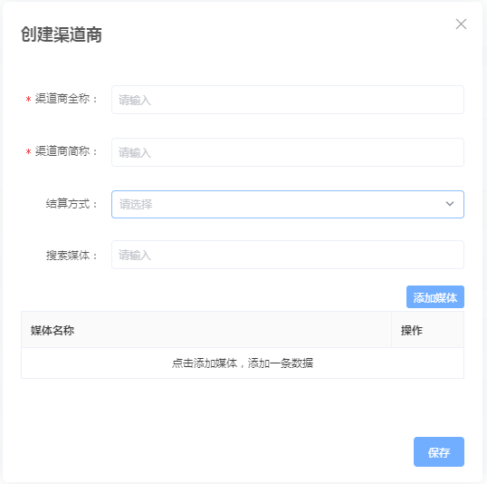

# 渠道机制与管理

## 一、概述

管理当前主体下所有的渠道，帮助对渠道进行数据统计与合作渠道管理。主要分为两个功能：渠道的创建，渠道商的管理。


建议首先阅读：[渠道相关名词解释](https://doc.skysriver.com/glossary#3-mai-liang-zhu-shou)、[买量助手使用流程](./#yi-shi-yong-liu-cheng)、[渠道类型说明](../channe_type.md)


## 二、功能简介

天幕买量助手的渠道管理分成两级，一级为渠道商，二级为媒体。

* **渠道商**：即合作的公司，例如您与腾讯合作，此时腾讯为合作的渠道商。
* **媒体**：具体的合作产品，即实际的下游戏。例如腾讯使用腾讯桌球与您合作，腾讯桌球即为一个媒体。
* **渠道ID**：每个渠道ID代表一个渠道商-媒体的关系，例如腾讯-腾讯桌球的渠道ID为XXXXXX，腾讯-跳一跳的渠道ID为XXXXXA。 渠道ID是针对渠道商-媒体的唯一ID，可在渠道管理中配置自动生成。

买量助手使用流程：[点击查看](https://cdn.kuaiyugo.com/tianmu/cms/2019-10-18_a5175a00f16611e9aa8c2517a70a9608.jpg)

## 三、渠道创建

### 1. 渠道的创建与渠道ID的生成

（1）点击【创建渠道】，进入渠道创建的弹窗，进行信息填写，按页面提示信息填写，点击保存后生成渠道ID。

（2）点击【批量创建】，可根据渠道条件以及数量两种模式快速批量创建渠道。

* 按渠道模式 按渠道模式需要选择投放的产品、渠道商以及媒体，系统将根据所选择的媒体各创建一个渠道ID。 例如游戏1选择渠道商A和B，媒体甲乙为渠道商A所属，媒体丙丁为渠道商B所属。通过按渠道模式批量创建，将会根据游戏1创建4条渠道ID，分别为渠道商A的甲乙两个渠道，渠道商B的丙丁两个渠道。 注：媒体至多可以选择50个。
* 按数量模式 按数量模式中所有的条件均为单选，您可以输入想要创建的数量（至多50条），根据您所选的条件批量创建相应数量的渠道ID。

### 2. 渠道路径的生成

在创建渠道操作时，您可以设置跳转路径。

*  默认为page/index/index,创建后将自动添加天幕系统的渠道参数，参数中包含渠道ID

跳转路径填写规则如下：

* 您需要填写类似"?foo=bar"这样的参数内容，例如您可以填写"?channelid=001"
* 默认的路径为page/index/index,创建后将自动根据您填写的内容添加天幕系统的渠道参数，参数中包含渠道ID。 例如：page/index/index?channelid=001&channelCode=XXXXX
* 若您未填写参数，则使用默认内容生成完整的路径
* 若您的路径非默认路径，可创建完成以后使用编辑修改路径
* 比如您除了使用天幕统计，还使用了微信官方的统计，只需将微信官方的路径参数填写进去，我们的系统将会在微信的路径后自动添加天幕的参数用于统计。 您填写了微信路径，例如：?wxgamecid=CCAAAAookkQQ997\_wwwwww，则生成的完整路径为：page/index/index?wxgamecid=CCAAAAookkQQ997\_wwwwww&channelCode=xxxxx。

### 3. 渠道信息的发送

点击操作中的发送渠道物料功能后会弹出一个窗口由您确认渠道投放产品等信息是否有误，可点击预览链接查看网页中呈现的信息，确认无误后点击复制链接即可将物料网页发送给合作方。

## 四、渠道商管理

渠道商管理功能可以帮助管理各种投放渠道的渠道商，不管渠道商再多，也可进行统一管理。

### 渠道商的创建与管理

创建一个渠道商仅需要填写全称、简称，媒体可在需要时添加。


拓展阅读：[渠道商与开放数据管理](https://doc.skysriver.com/channel/main-features/distributor)


