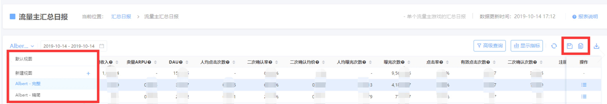

# 自定义视图

## 高级搜索及显示指标

天幕的大部分数据报表中均支持进行“高级查询”和调整“显示指标”

* 高级查询：多种查询条件的**联合搜索**
* 显示指标：选择当前报表的**显示指标**及**指标显示顺序**

每个使用者的所在角色及用户习惯不同，针对数据所做的筛选及展示的指标也不同，每次查看数据都需要重新调整会相当的耗时耗力。

## 自定义视图的保存与查看

自定义视图，可保存当前设定的“高级查询”和“显示指标”，避免每次进行重复设定。

帮助您最快时间筛选出您需要的数据。


自定义视图可保存当前的筛选条件、展示指标及指标顺序，建议使用


### 1、 另存并新建一个视图

利用右侧“另存”按钮将当前配置存为新视图、“保存”按钮更新当前视图的配置；

### 2、 查看视图列表

利用左侧下拉框选择视图。

## 自定义视图的共享

自定义视图支持共享给其他伙伴，其他伙伴可通过导入配置文件快速创建一个包含相同指标配置的新视图。

### 1、 视图的导出

点击左上角视图列表红框中的按钮，可以导出当前视图的配置文件。

### 2、视图的导入

首先在视图列表中选择“新建+”；

接着点击弹窗中的“点击导入”，选择其他伙伴分享给你的配置文件，即可导入创建一个新视图。新视图包含了伙伴的指标配置，但不包含他的高级查询筛选条件。

