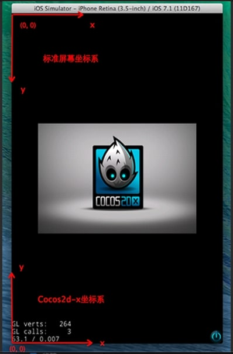

# .createFlow

## 概述

请先完成阅读：[组件化方式接入广告位](../)


使用该接口前，请先进行[SDK初始化](../../initialization.md)


`createFlow`组件是用来实现广告位自动渲染：

* 只要确定广告位的参数与需要渲染的位置即可，SDK会根据广告位ID自动渲染出对应类型的广告位
* 支持点击后自动跳转，自动刷新创意等功能

也可以参阅实例，看看如何在实际中使用`createFlow`渲染广告位。









## **接口描述**

* 调用该组件后，自动按照推广位类型渲染UI，并支持点击、动态效果等
* cocos引擎中，请在画布初始化完毕后才调用`createFlow`
* cocos引擎依赖ScrollView模块

## **使用标准屏幕坐标系定位**



## **使用实例**

```javascript
let flowUI = wx.tmSDK.createFlow({
    positionId: 1260，
    x: 0,     
    y: 300,   
});
// 监听销毁事件，闪屏中可以用于闪屏结束后做场景切换
flowUI.onDestroy(function(){
   console.log('销毁成功')
});
// 监听错误事件
flowUI.onError(function({message}){
    console.log(message)
});
// 监听初始化事件
flowUI.onRender(function({message}){
    console.log(message)
});
```

## **参数**

| 参数 | 字段名称 | 字段说明 |
| :--- | :--- | :--- |
| positionId | 广告位id | 广告位id |
| x | 渲染x轴位置 | 推广位在画布中的渲染X轴方向位置，坐标原点为视图左上角 |
| y | 渲染y轴位置 | 推广位在画布中的渲染Y轴方向位置，坐标原点为视图左上角 |
| width\(可选参数\) | 渲染宽度 | 可选参数，设置后可调整推广位尺寸, 不设置则使用默认尺寸, 最小值为100,最大值为默认广告类型宽 |
| zIndex\(可选参数\) | 渲染层级 | 可选参数，设置后可调整UI的渲染层级， 默认值为999999999 |

## **销毁**

正常情况下，游戏场景切换时，该UI组件会自动销毁。如果需要在某些场景销毁该组件，请使用`destroy`方法。

```javascript
flowUI.destroy();
```

## **可选参数: width**

* 1、浮动icon类型下，可等比例设置渲染宽度，最小值为100，比例固定为190:270。
* 2、设置的宽度类型会根据当前尺寸画布与1080\*1920的标准尺寸画布进行缩放。

```javascript
let flowUI = tm_sdk.createFlow({
    ...,  
    width: 250, // 自定义浮动icon宽度为：在1080*1920尺寸下的宽度为250px。
});
```

## **可选参数: zIndex**

* 1、可自定义设置渲染组件的层级
* 2、闪屏类型默认值则为加999999999 + 1，其他类型默认值为999999999。
* 3、实际显示的层级数会被引擎自动调整

```javascript
let flowUI = wx.tmSDK.createFlow({
    ...,  
    zIndex: 250, // 设置组件层级为250, 实际显示的层级会被引擎所调整。
});
```

## **onDestroy**

* 1、监听组件的销毁
* 2、可多个监听
* 3、返回message，销毁成功信息

```javascript
flowUI.onDestroy(function({from, message}){
    console.log(from, message)
});
```

## **offDestroy**

1. 取消监听组件的销毁事件
2. 传入与监听相同的回调函数只取消该回调

```javascript
let destroyCallBack = function({from, message}){ // 假设onDestroy的时候绑定的为该函数
    console.log(from, message)
};
flowUI.offDestroy(); // 取消所有销毁监听事件
flowUI.offDestroy(destroyCallBack);  // 取消某个监听事件
```

## **onRender**

1. 监听组件的初始化
2. 可多个监听
3. 返回message，初始化成功信息

```javascript
flowUI.onRender(function({message}){
    console.log(message)
});
```

## **offRender**

1. 取消监听组件的初始化
2. 传入与监听相同的回调函数只取消该回调

```javascript
let renderCallBack = function({message}){ // 假设onDestroy的时候绑定的为该函数
    console.log(message)
};
flowUI.offRender(); // 此取消所有销毁监听事件
flowUI.offRender(renderCallBack);  // 取消某个监听事件
```

## **onError**

1. 监听组件的错误信息
2. 可多个监听
3. 返回message错误详情

```javascript
flowUI.onError(function({message}) {
    console.log(message)
});
```

## **offError**

1. 取消监听组件的初始化
2. 传入与监听相同的回调函数只取消该回调

```javascript
let errorCallBack = function({message}){ // 假设onDestroy的时候绑定的为该函数
    console.log(message)
};
flowUI.offError(); // 此取消所有销毁监听事件
flowUI.offError(errorCallBack);  // 只取消errorCallBack监听事件
```

## **监听广告位跳转事件**

1. 监听广告位是否触发点击跳转
2. 回调参数中为返回的原始微信信息

   ```javascript
   flowUI.onNavigate(function(msg) {
    console.error(msg);
   })
   ```

## **取消监听广告位跳转事件**

```javascript
let callBack = function(error){
    console.log(error)
};
flowUI.offNavigate(callBack);  // 取消某个监听事件
```

