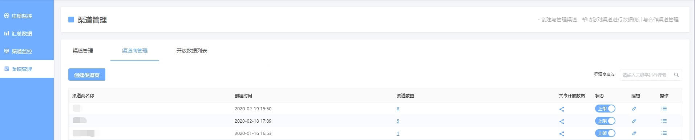
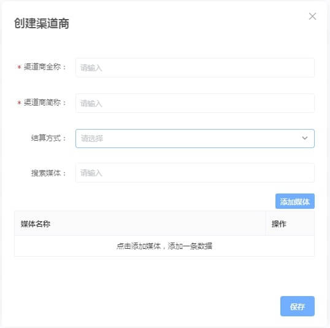

# 结算单管理

## 一、概述

如果您作为流量主，对外销售卖量，结算单管理后台可以帮助您创建需要核对内容信息的结算对账单给合作的广告主客户。

您只需简单的几个操作便可以生成结算单，该管理后台仅默认向管理员开放，若普通成员需要开放权限，请联系管理员开通权限。

## 二、使用说明

### 1、准备工作

在生成结算单前，您还需要先准备以及确认好以下三个内容。

#### （1）填写正确的客户、客户投放的广告主游戏及客户公司信息

操作位置：卖量助手-广告主游戏管理

首先您需要在“客户管理”功能中创建与您合作的客户，点击左上角添加客户进入创建界面。

接着为该客户添加客户名称、用于结算时开票的公司信息以及寄送结算的联系信息。


我们承诺，该信息将仅用于创建结算单时提供客户结算公司内容以及开发票时的购买方信息，绝不会用于其他用途。


最后将已添加的广告主游戏，选择好对应的客户。

#### （2）上传卖量收入

操作位置：游戏收支-卖量收入管理

这一步您需要到游戏收支-卖量收入管理中上传您的卖量收入，只要您第一步准备工作中已经将客户与游戏的信息全部编辑好了，只需正常按照卖量收入管理的流程上传所有的卖量收入即可。

相关阅读推荐：[游戏收支-卖量收入管理](../../general-function/revenue/flow-income-management.md)

#### （3）填写正确的我方公司信息

操作位置：卖量助手-结算单管理

准备工作的最后一部，您需要访问结算单管理后台菜单，点击我方公司管理，填写我方的收款公司信息，该信息用于创建结算单时提供开发票中的销售方信息，操作步骤与客户公司信息的填写类似。

### 2、创建结算单

在准备工作完成以后，我们可以开始创建结算单。

操作位置：卖量助手-结算单管理-点击左上角“创建结算单”

#### （1）选择需要结算的客户与结算周期等信息

第一步必须要填写结算的客户、结算周期与结算业务名称，其中结算业务名称可以填写为“小游戏卖量”，您可以自行修改为其他。

#### （2）确认结算的游戏与结算的数据

第二步中，如果您之前已经完成了准备工作，填写了客户所属游戏、上传了卖量收入，此时系统自动填写了结算周期内的记录，您可以视情况删除记录。

这一步中您只需要修改结算模式，结算模式默认为CPA（以新增注册用户数指标结算），同时您也可以选择其他模式，具体如下。

* CPA-新增注册用户数
* CPC-二次确认次数
* CPUV-访问人数

#### （3）确认客户公司信息

第三步需要确认客户的公司信息，该信息即为发票的购买方公司信息。

如果您之前已经填写好了客户公司信息，只需直接选择即可；如果需要增加，则点击“添加客户公司”即可创建添加新的客户公司信息。

#### （4）确认我方公司信息

第四步需要确认我方的公司信息，该信息即为发票的销售方信息。

这一步的操作与上一步客户信息类似，如果已填写好信息直接选择即可；如果需要增加公司，则点击“添加我方公司”进行创建添加。

#### （5）预览与确认结算单

在最后一步，您只需要在预览的结算单中确认之前的信息是否有误，若没有问题点击底部生成结算单后即可生成一个结算单。

### 3、结算单管理

在结算单正常填写生成以后，会返回结算单管理列表，并打开一个生成的结算单PDF文件，您可以下载该文件提供给合作的客户进行确认。

结算单管理的主要操作如下。

* 高级查询筛选 在结算单列表中，您可以根据我方（即我方公司）、客户（客户公司）以及结算单状态进行查询筛选。
* 结算单的废弃 为确保结算单的信息不丢失与被篡改，结算单不可删除与修改，若发现结算单内容有误，您可以使用操作中的“废弃”功能，此时结算单状态就被标记为“废弃”，将不再默认展示在列表中。
* 结算单的查看 您可以点击左侧结算单号，查询该结算单的明细数据，可用于客户与我方进行信息核对。 您可以点击列表中的“查看”直接查看该结算单的PDF文件。

